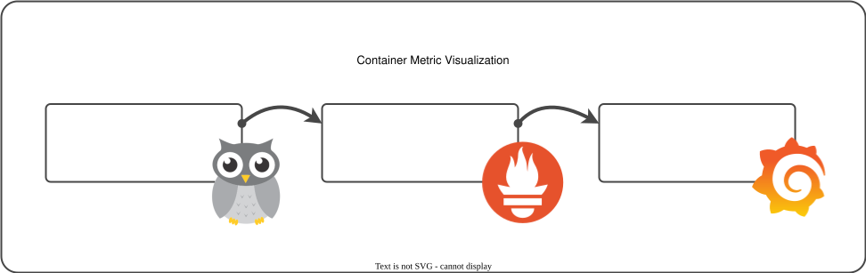

# Metrics with cAdvisor and Prometheus



In this lab, we will monitor the container status using cAdvisor and Prometheus. The lab is based on `docker`..

## cAdvisor to expose container metrics

First thing first, let us start cAdvisor and explore the metrics.

[//]: <> (lab-instruction)

```bash
docker run -d -p 8081:8080 --privileged --rm \
  --name=lab.01-cadvisor \
  --volume=/:/rootfs:ro \
  --volume=/var/run/docker.sock:/var/run/docker.sock:rw \
  --volume=/sys:/sys:ro \
  --volume=/var/lib/docker/:/var/lib/docker:ro \
  --volume=/dev/disk/:/dev/disk:ro \
  gcr.io/cadvisor/cadvisor
```

This command will start cAdvisor and expose the metrics on port 8081. You can access the metrics
at [http://localhost:8081/metrics](http://localhost:8081/metrics). Try to find out the metric
`container_cpu_usage_seconds_total` in the metrics for the current container `lab.01-cadvisor`.

<details>
<summary>✅ Test: cAdvisor is reachable via port 8081</summary>

[//]: <> (lab-instruction)

```bash
echo "[TEST] cAdvisor is reachable via port 8081"
check_reachable_via_curl "http://localhost:8081/metrics" "container_cpu_usage_seconds_total"
```

</details>

<details>
<summary>✅ Test: We can retrieve container information</summary>

[//]: <> (lab-instruction)

```bash
echo "[TEST] We can retrieve container information"
check_reachable_via_curl "http://localhost:8081/metrics" "lab.01-cadvisor"
```

</details>

## Prometheus to scrape the metrics and store them

Now that we have cAdvisor running, let us start Prometheus to scrape the metrics and store them in its
time-series database.

We have to create a configuration file for Prometheus. Create a file `prometheus.yaml` with the following content:

[//]: <> (lab-instruction)

```bash
cat <<EOF > prometheus.yaml
global:
  scrape_interval: 15s

scrape_configs:
  - job_name: 'cadvisor'
    static_configs:
      - targets: ['lab.01-cadvisor:8080']
EOF
```

Start Prometheus with the configuration file `prometheus.yaml`.

[//]: <> (lab-instruction)

```bash
docker run -d -p 9091:9090 --rm --name lab.01-prometheus \
  --volume ./prometheus.yaml:/etc/prometheus/prometheus.yaml \
  prom/prometheus:latest \
  --config.file=/etc/prometheus/prometheus.yaml
```

<details>
<summary>✅ Test: Prometheus is reachable via port 9091</summary>

[//]: <> (lab-instruction)

```bash
check_reachable_via_curl "http://localhost:9091/metrics" "prometheus_build_info"
```

</details>

## Grafana

Run the following command to start Grafana

[//]: <> (lab-instruction)

```bash
docker run -d -p 3000:3000  --name lab.01-grafana grafana/grafana
```

<details>
<summary>Test: Grafana is reachable via port 3000</summary>

[//]: <> (lab-instruction)

```bash
echo "[TEST] Grafana is reachable via port 3000"
check_reachable_via_curl "http://localhost:3000/api/health" "version"
```

</details>

## Cleanup

[//]: <> (lab-instruction)

```bash
docker stop lab.01-cadvisor
docker stop lab.01-grafana
docker stop lab.01-prometheus
rm prometheus.yaml
```

Start cAdvisor, Prometheus and Grafana

[//]: <> (lab-instruction)

```bash
echo "Start cAdvisor, Prometheus and Grafana"
docker compose up -d
echo "Wait for 10 seconds"
```

[//]: <> (lab-instruction)

```bash
docker compose down
```

Checkout the services

| Service    | URL                                                                    |
| ---------- | ---------------------------------------------------------------------- |
| cAdvisor   | [http://localhost:8080/containers/](http://localhost:8080/containers/) |
| Prometheus | [http://localhost:9090/](http://localhost:9090/)                       |
| Grafana    | [http://localhost:3000/](http://localhost:3000/)                       |


## References

[Failed to get docker info in macOS](https://github.com/google/cadvisor/issues/1565)
